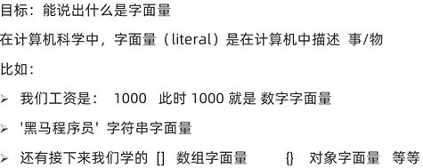
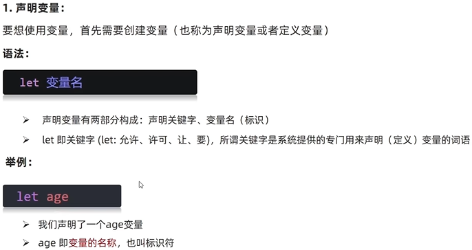

# JS 基础
## 一、JS简介
### 1、定义
  

### 2、组成
  
`https://developer.mozilla.org/zh-CN/`

### 3、书写位置
#### (1)行内JavaScript  

#### (2)外部

#### (3)内联


### 4、注释


### 5、结束符


### 6、输入和输出语法
#### (1)输出语法

```
// 显示在网页中
document.write('i am h1')
// 以标题格式显示在网页中
document.write('<h1>i am h1</h1>')
// 显示在弹框中
alert('help')
// 显示在控制台中
console.log('console print')
```
#### (2)输入语法

`prompt('input your name')`

### 7、代码执行循序
按照HTML文档流执行JS代码  
alert()和prompt()会跳过页面渲染而先被执行

### 8、字面量


## 二、变量
### 1、定义


### 2、基本使用
#### (1)变量的声明

#### (2)变量的赋值

#### (3)更新变量
let不允许多次申明一个变量
#### (4)声明多个变量
`let age = 18, name = 'kang'`
`console.log(age, name)`


### 3、本质


### 4、命名规则与规范


### 5、let和var的区别


### 6、数组
#### (1)声明

#### (2)一些术语


## 三、常量


## 四、数据类型
js弱数据类型语言,只有赋值以后，才能确认 
### 1、数字类型
  
NAN not a number  
  

### 2、字符串类型string
#### (1)定义

#### (2)字符串拼接
可使用加号进行字符串拼接 
```
let age = 20
document.write('I am ' + age +' years old')
``` 
#### (3)模板字符串


### 3、布尔类型boolen


### 4、未定义类型undefined


### 5、null空类型
  
null与undefined的区别  


### 6、检测数据类型typeof


## 五、类型转换
### 1、定义

### 2、隐式转换
  
`console.log(+'12')    //输出数字类型12`  
`let num = +prompt("input your age")    //num此时转变为数字型`
### 3、显式转换
  
parseInt和parseFloat只能截取字符串前段数字，如果字符串以字母开头，则会返回NaN
```
let a = prompt("first one")
let b = prompt("second one")
alert(Number(a)+Number(b))

let a = +prompt("first one")
let b = +prompt("second one")
alert(a+b)
```

## 六、运算符
### 1、赋值运算符


### 2、一元运算符
自增运算符：i++和++i,与cpp相同

### 3、比较运算符

`console.log(2=='2');    //true，比较运算符存在隐式转换，把'2'转换为2 `  
判断是否相等用===  

  
### 4、逻辑运算符


### 5、运算符优先级


## 七、分支语句
语句和表达式的区别

### 1、if语句
  
   


### 2、三元运算符


### 3、switch语句


### 4、断点调试


## 八、循环语句
### 1、while循环
#### (1)基本语法

#### (2)循环三要素

#### (3)循环推出


### 2、for循环
#### (1)for循环的基本使用

#### (2)循环嵌套


## 九、数组
### 1、基本使用

### 2、遍历数组

### 3、数组操作

#### (1)增
  

#### (2)删
##### pop

##### shift

##### splice


## 十、函数


### 1、函数使用
#### (1)函数声明

#### (2)命名规范

#### (3)函数使用


### 2、函数传参
  

#### 默认参数


### 3、函数返回值
***如何返回多个数据：数组***  
  
 

### 4、细节补充
   

### 5、作用域
#### (1)全局作用域和局部作用域
  
#### (2)全局变量和局部变量
```
let num = 10                     //num为全局变量,可在函数内部访问
console.log(num)
function fn(){
  console.log(num)
}
fn()
```

  
#### (3)变量访问原则


### 6、匿名函数
匿名函数无法直接使用  
#### (1)函数表达式
```
// 具名函数的调用可以写到任何位置
// 函数表达式，必须先声明函数表达式，后调用
let fn = function(){
  console.log();
}
fn()
```

#### (2)立即执行函数