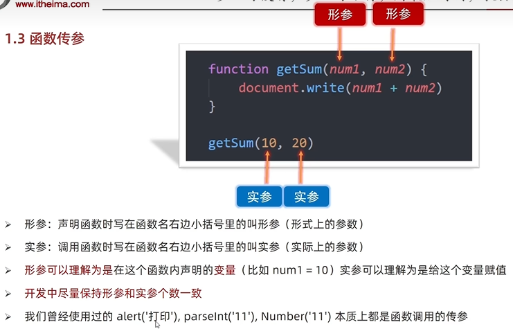
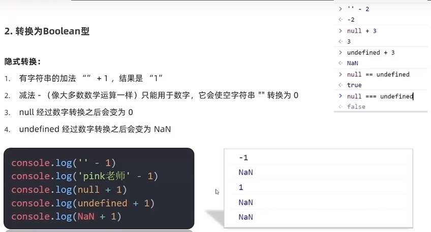

# JS 基础
## 一、JS简介
### 1、定义
  

### 2、组成
  
`https://developer.mozilla.org/zh-CN/`

### 3、书写位置
#### (1)行内JavaScript  

#### (2)外部

#### (3)内联


### 4、注释


### 5、结束符


### 6、输入和输出语法
#### (1)输出语法

```
// 显示在网页中
document.write('i am h1')
// 以标题格式显示在网页中
document.write('<h1>i am h1</h1>')
// 显示在弹框中
alert('help')
// 显示在控制台中
console.log('console print')
```
#### (2)输入语法

`prompt('input your name')`

### 7、代码执行循序
按照HTML文档流执行JS代码  
alert()和prompt()会跳过页面渲染而先被执行

### 8、字面量


## 二、变量
### 1、定义


### 2、基本使用
#### (1)变量的声明

#### (2)变量的赋值

#### (3)更新变量
let不允许多次申明一个变量
#### (4)声明多个变量
`let age = 18, name = 'kang'`
`console.log(age, name)`


### 3、本质


### 4、命名规则与规范


### 5、let和var的区别


### 6、数组
#### (1)声明

#### (2)一些术语


## 三、常量


## 四、数据类型
js弱数据类型语言,只有赋值以后，才能确认 
### 1、数字类型
  
NAN not a number  
  

### 2、字符串类型string
#### (1)定义

#### (2)字符串拼接
可使用加号进行字符串拼接 
```
let age = 20
document.write('I am ' + age +' years old')
``` 
#### (3)模板字符串


#### (4)trim()方法
字符串的trim方法可以去除字符串左右两侧的空格，字符串中间的空格被保存  
```
const str = '     pink   '
console.log(str.trim())       //输出pink，两侧的空格被去除
```

### 3、布尔类型boolen


### 4、未定义类型undefined


### 5、null空类型
  
null与undefined的区别  


### 6、检测数据类型typeof


## 五、类型转换
### 1、定义

### 2、隐式转换
  
`console.log(+'12')    //输出数字类型12`  
`let num = +prompt("input your age")    //num此时转变为数字型`
### 3、显式转换
  
parseInt和parseFloat只能截取字符串前段数字，如果字符串以字母开头，则会返回NaN
```
let a = prompt("first one")
let b = prompt("second one")
alert(Number(a)+Number(b))

let a = +prompt("first one")
let b = +prompt("second one")
alert(a+b)
```

## 六、运算符
### 1、赋值运算符


### 2、一元运算符
自增运算符：i++和++i,与cpp相同

### 3、比较运算符

`console.log(2=='2');    //true，比较运算符存在隐式转换，把'2'转换为2 `  
判断是否相等用===  

  
### 4、逻辑运算符


### 5、运算符优先级


## 七、分支语句
语句和表达式的区别

### 1、if语句
  
   


### 2、三元运算符


### 3、switch语句


### 4、断点调试


## 八、循环语句
### 1、while循环
#### (1)基本语法

#### (2)循环三要素

#### (3)循环推出


### 2、for循环
#### (1)for循环的基本使用

#### (2)循环嵌套


## 九、数组
### 1、基本使用

### 2、遍历数组

### 3、数组操作

#### (1)增
  

#### (2)删
##### pop

##### shift

##### splice


## 十、函数


### 1、函数使用
#### (1)函数声明

#### (2)命名规范

#### (3)函数使用


### 2、函数传参
  

#### 默认参数


### 3、函数返回值
***如何返回多个数据：数组***  
  
 

### 4、细节补充
   

### 5、作用域
#### (1)全局作用域和局部作用域
  
#### (2)全局变量和局部变量
```
let num = 10                     //num为全局变量,可在函数内部访问
console.log(num)
function fn(){
  console.log(num)
}
fn()
```

  
#### (3)变量访问原则


### 6、匿名函数
匿名函数无法直接使用  
#### (1)函数表达式
```
// 具名函数的调用可以写到任何位置
// 函数表达式，必须先声明函数表达式，后调用
let fn = function(){
  console.log();
}
fn()
```

#### (2)立即执行函数
无需调用，直接执行,多个立即执行函数直接必须使用分号隔开  

```
// 语法1
(function (){})()
// 语法2
(function(){}())
```


### 7、逻辑中断

```
//给a的赋值不是true or false，而是a或0，在逻辑运算中，undefined被当做false，而进行右边的运算，给a赋值0，函数是为了防止没有实参而导致报错，可用默认参数代替实现
function fn(a, b) {
  a = a || 0                    
  b = b || 0
  console.log(x + y);
}
```

### 8、bool类型转换



## 十一、对象
### 1、定义


### 2、对象使用-属性
#### (1)声明语法

#### (2)属性

#### (3)查
```
// 查的两种方式
对象名.属性民  obj.age
对象名['属性名']  obj['age']
```  
  

#### (4)改

#### (5)增

#### (6)删


### 3、对象使用-方法


### 4、遍历对象

  
只能使用obj[k]这一方法来遍历对象，相当于查操作的第二种方式，因为k的本质上是一个string型变量  
很少使用for-in语法来遍历数组  
```
let arr = [ 'pink','red', 'blue']
for (let k in arr) {
  console.log(k)                // 数组的下标 索引号 但是,此时k是字符串型
  console.log(arr[k])           // arr[k]
}
```
### 5、内置对象
#### (1)定义
JavaScript内部提供的对象，包含各种属性和方法给开发者调用
#### (2)内置对象-Math

`https://developer.mozilla.org/zh-CN/docs/Web/JavaScript/Reference/Global_Objects/Math#%E5%B1%9E%E6%80%A7`
#### (3)内置对象-生成任意范围随机数


## 十二、一些扩展
### 1、术语解释


### 2、基本数据类型/引用数据类型
   
  
```
let num = 10
let num2 = num
num = 20
console.log(num2)                               // 10

let obj1 = {age: 18}
let obj2 = obj1
obj1.age = 20
console.log(obj2)                               // 20
```

### 3、变量声明和const优先
   
  

# WEB APIs
## 一、Web API基本认知
### 1、作用和分类


### 2、DOM定义
Document Object Model 文档对象模型


### 3、DOM树


### 4、DOM对象(重要)


## 二、获取DOM对象
### 1、根据CSS选择器来获取DOM元素(重点)
#### (1)doucument.querySelector('CSS 选择器')

#### (2)doucument.querySelectorALL('CSS 选择器')
  


### 2、其他获取DOM元素方法(了解)


## 三、操作元素内容
### 1、对象.innerText属性
  
```
const box = document.querySelector('.box')
console.log(box.innerText)                   
box.innerText='<strong>我是一个盒子</strong>'
console.log(box.innerText)         //显示<strong>我是一个盒子</strong>，innerText不解析标签
```
### 2、对象.innerHTML属性
innerHTML与innerText属性基本相同，只是innerText会解析标签  

```
const box = document.querySelector('.box')
console.log(box.innerTHTML)                   
box.innerText='<strong>我是一个盒子</strong>'
console.log(box.innerText)         //加粗显示'我是一个盒子'，innerHTML解析标签
```

## 四、操作元素属性
### 1、操作元素常用属性

```


<script>
  const img = document.querySelector('img')
  img.src='../JS笔记/images/QQ截图20230824180618.png'
  img.title='qq截图'
</script>
```

### 2、操作元素样式属性

#### (1)通过style属性操作CSS
  
document.body可以直接获得，不需要使用querySelector方法
```
<div class="box"></div>
<script>
  const box = document.querySelector('.box')
  box.style.width = '400px'
  // 多组单词的采取小驼峰命名法，background-color中的-会被解析成减号从而报错
  // box.style.background-color='blue'，会报错
  box.style.backgroundColor='blue'
</script>
```

#### (2)通过操作类名(className)操作CSS
使用className可以同时修改多个样式，但是，直接使用className赋值会覆盖以前的类名  
如果需要保留多个属性，在赋值时需要加上多个类名
  
```
<style>
  div {
    width: 200px;
    height: 200px;
  }

  .one {
    background-color: blue;
  }

  .two {
    border: 2px solid black;
  }
</style>

<body>
  <div>111</div>
  <div class="one two"></div>
  <script>
    const div = document.querySelector('div')
    div.className = 'one'            //div会添加类名，相当于变成<div class="one"></div>
    div.className = 'two'            //会覆盖原来的类名，相当于变成<div class="one"></div>,会覆盖原来所有的类名
    div.className = 'one two'        //标签<div class="one two"></div>
  </script>
</body>
```
#### (3)通过classList操作类控制CSS
`div.classList.add('one')`此时类名不用加点，因为classList追踪的对象只能是类名
  
toggle()切换类，有就删掉，没有就加上  
`box.calssList.toggle('active')`
#### (4)className和classList的区别
  

### 3、操作表单元素属性
表单的值由`表单.value`得到，而非`表单.innerHTML`
  
  
  


```
<button>按钮</button>
<input type="checkbox">

<script>
  const bt = document.querySelector('button')
  bt.disabled = true
  const ipt = document.querySelector('input')
  ipt.checked = true
</script>
```

### 4、自定义属性


## 五、定时器-间歇函数
### 1、定时器函数介绍


### 2、定时器函数基本使用
`setInterval(函数,间隔时间)    //函数名不需要加小括号`
#### (1)开启定时器

#### (2)关闭定时器

#### (3)实例代码
```
const btn = document.querySelector('.btn')
    let i = 5
    const n = setInterval(function () {
        i--
        btn.innerHTML = `我已经阅读用户协议(${i})`
        if (i === 0) {
            clearInterval(n)
            btn.disabled = false
            btn.innerHTML = '同意'
        }
    }, 1000)
```

## 六、事件监听
### 1、定义
  

### 2、语法
  
  
 
```
// 点击关闭
const box1 = document.querySelector('.box1')
const box = document.querySelector('.box')

box1.addEventListener('click',function(){
  box.style.display = 'none'
})
```

### 3、事件监听版本(了解)
  
  

### 4、事件类型

#### (1)鼠标触发
#### (2)焦点事件
```
const input = document.querySelector('input')
input.addEventListener('focus',function(){
  console.log('有焦点');
})
input.addEventListener('blur',function(){
  console.log('失去焦点');
})
```
#### (3)键盘事件
```
// 键盘上按下任意键则会触发keydown事件，抬起键盘则会触发keyup事件 
const input = document.querySelector('input')
input.addEventListener('keydown',function(){
  console.log('keydown');
})

input.addEventListener('keyup',function(){
  console.log('keyup');
})
```

#### (4)用户输入
```
const input = document.querySelector('input')
input.addEventListener('input',function(){
  console.log(input.value);                         //用户的输入通过input.value得到，类型为字符串，可以通过length属性得到
})
```

### 5、事件监听的调用
```
next.addEventListener('click', function () {
  i = (i + 1) % sliderData.length
  toggle()
})

next.click()   //相当于触发了一次click事件
```

## 七、事件对象
### 1、定义及使用场景
  
### 2、语法


### 3、事件对象的常用属性

#### ()示例代码
```
const input = document.querySelector('input')
input.addEventListener('keyup',function(e){
  if(e.key === 'Enter')
  console.log('press enter');
})
```


