# 快捷键
注释快捷键 ctrl+/；    
同时选择相同内容的快捷键 ctrl+d；  
复制粘贴的快捷键shift+alt+下；  
选中多个位置，可在多个位置同时输入 alt+鼠标左键；  
macOS中，qq截屏快捷键为control+command+A；  
如果想要加入多个空格，空格的字符实体为nbsp；
macos中，刷新网页的快捷键是command+r；  
alt+下 可以调整代码位置；

# 小技巧
解决盒子内部溢出的问题overflow:hidden；
取背景精灵图的右半部分background-position: right 0；  
查询兼容性问题 https://caniuse.com/；  
单行文字溢出显示省略号解决办法 P103 https://www.bilibili.com/video/BV1xq4y1q7jZ?t=445.3&p=103：  
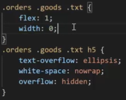


# MarkDown使用教程
## 一、换行
1 行尾两个空格  
2 HTML的\<br>标签   
## 二、强调
### 1、加粗  
加粗文本，请在单词或短语的前后各添加**两个**星号或下划线  
加粗一个单词或短语的中间部分用以表示强调的话，加粗部分的两侧各添加两个星号  
### 2、斜体
斜体显示文本，在单词或短语前后添加 *一个* 星号或下划线  
斜体突出单词的中间部分，字母前后各添加一个星号，中间不要带空格
### 3、粗体和斜体
在单词或短语的前后各添加三个星号或下划线  
突出单词的中间部分，字母前后各添加三个星号，中间不要带空格


# HTML Hyper Text Markup Language
## 一、标题标签
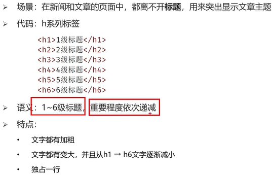
## 二、段落标签
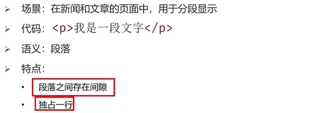
## 三、换行标签
\<br>  
## 四、水平线标签
\<hr>
## 五、文本格式化标签
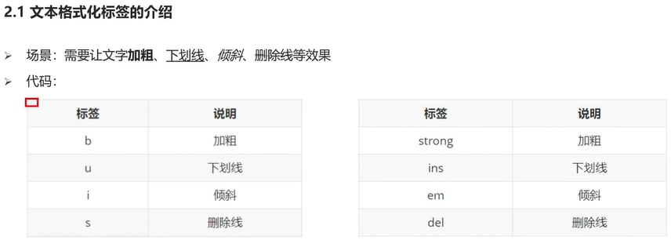
## 六、图片标签
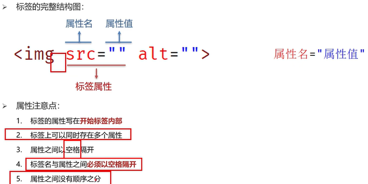
图片标签的属性  
alt:替换文本  
title：鼠标悬停时显示的文本  
width/height：图片的高度和高度，只输入一个属性时另一个等比例缩放  
## 七、音频标签audio
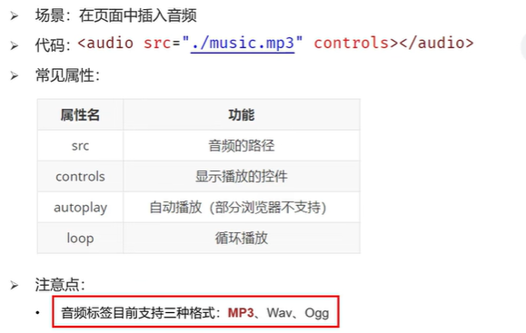
## 八、视频标签
在google浏览器中，可以实现视频的静音自动播放  
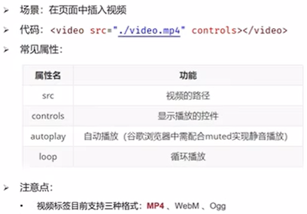
## 九、链接标签
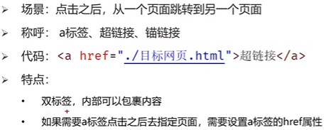  
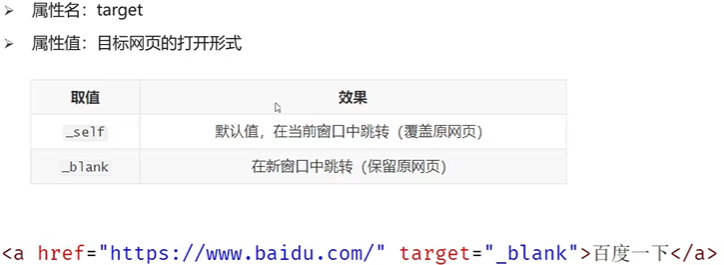
## 十、列表标签
### 1、无序列表
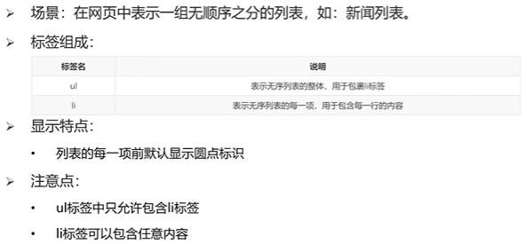
### 2、有序列表
与无序列表的区别只在于ol  
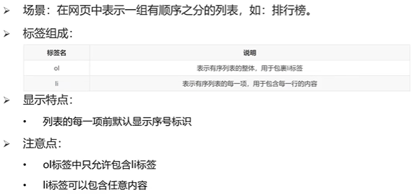
### 3、自定义列表
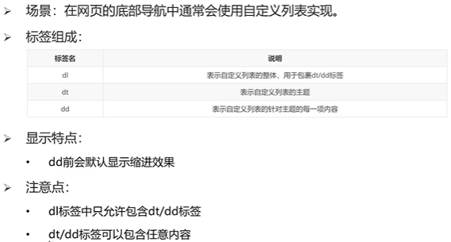
## 十一、表格标签
### 1、基本标签
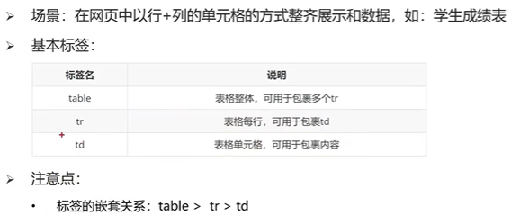  
### 2、表格相关属性  
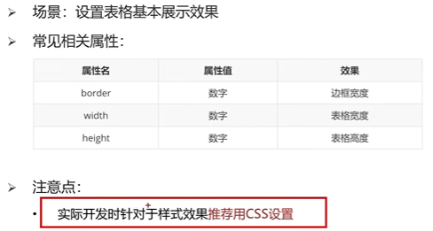  
### 3、表格标题和表头单元格标签  
    caption的位置与tr标签位置平行
    th标签用于替换td标签
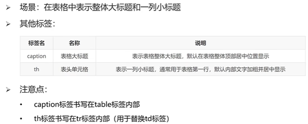  
### 4、表格的结构标签  
作用:增强代码可读性与执行速度  
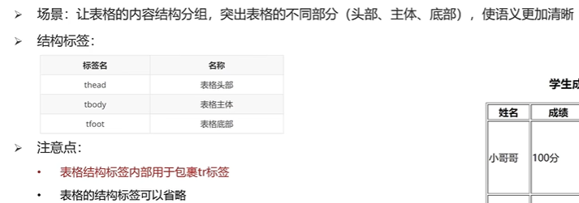
### 5、合并单元格
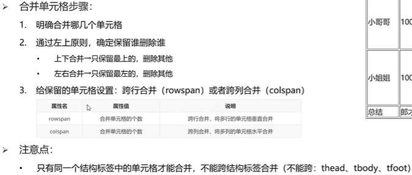
## 十二、表单标签
### 1、input系列标签
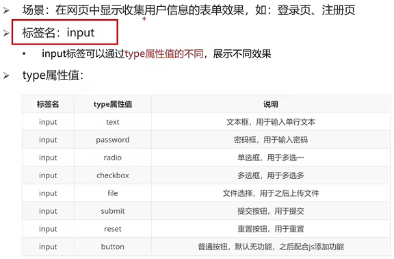     
text/password占位符：用于显示提示信息，属性值为placeholder  
radio单选框：单选功能：两个input中使用相同的name属性 默认选中：在input标签添加checked  
file上传多个文件：在input内添加multiple  
按钮 reset按钮需要配合表单域标签form作为其父级标签一起使用
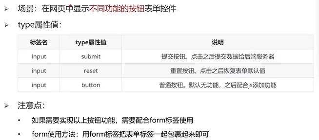
### 2、button按钮标签
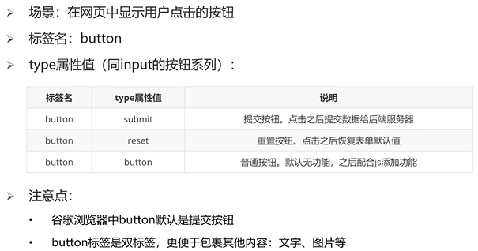
### 3、select下拉菜单标签
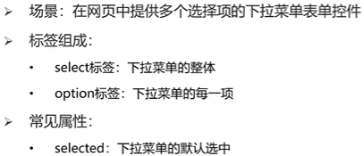
### 4、textarea文本域标签
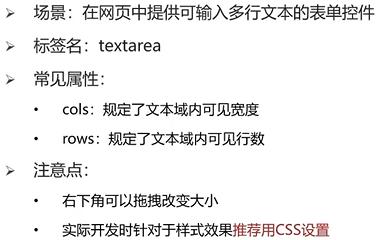
### 5、label标签
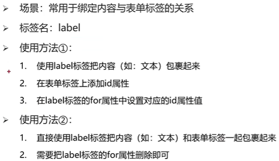
## 十三、语义化标签
### 1、无语义的布局标签div span
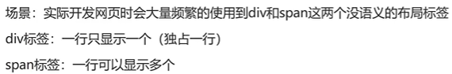
### 2、有语义的布局标签（了解，移动端常用）
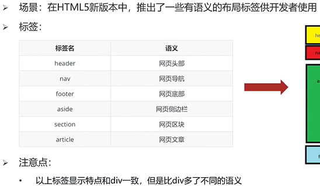


# CSS
Cascading Style Sheets  
在css中，大小的单位是px（pixel），即像素  
选多行加相同内容alt+shift+鼠标左键单击

## 一、基础认识
css的引入方式，css能写在哪  
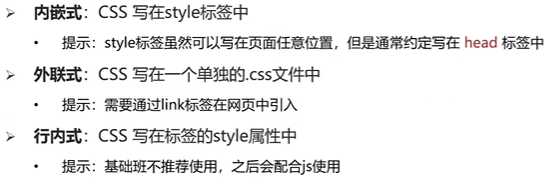

## 二、基础选择器
### 1、标签选择器
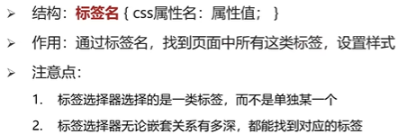
### 2、类选择器
类选择器的定义在style里用点开头，使用在标签内添加class属性，此时不加点
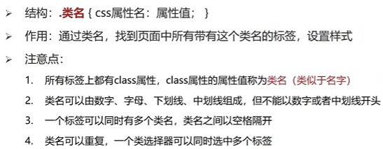
### 3、id选择器
配合js使用  
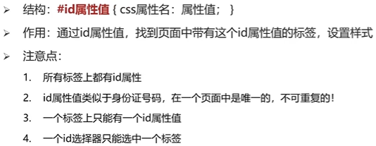
### 4、通配符选择器
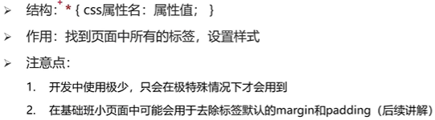

## 三、字体和文本样式
### 1、字体样式
#### (1)字体大小
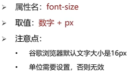
#### (2)字体粗细
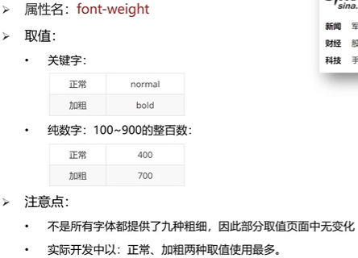
#### (3)字体样式(是否倾斜)
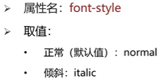
#### (4)字体类型
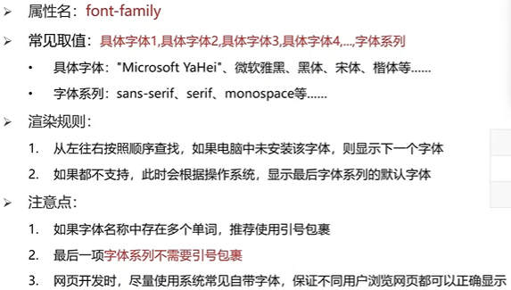  
如果给同一标签的相同属性设置了不同的值，此时样式会覆盖，写在最下面的样式会生效
#### (5)font属性连写
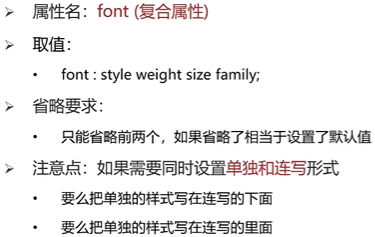
### 2、文本样式
#### (1)文本缩进：text-indent
取值：数字+px，数字+em（em表示当前标签font-size的大小）
#### (2)文本水平对齐方式：text-align
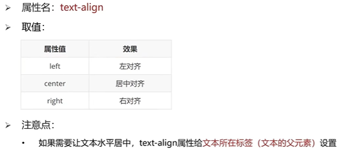
#### (3)文本修饰：text-decoration
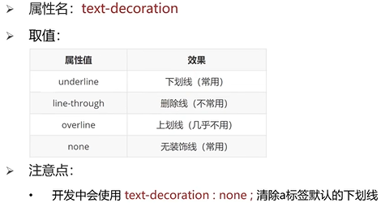
### 3、line-height行高
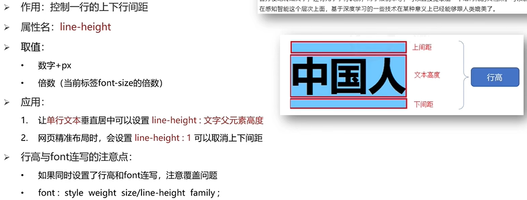
### 4、常见颜色取值
background-color指的是标签背景颜色  
color指的是标签内部内容的颜色
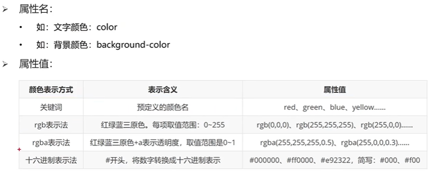
### 5、扩展-标签水平居中的写法
在标签内添加 margin:0 auto

## 四、选择器进阶
选择器的目的就是为了找标签
### 1、复合选择器
#### (1)后代选择器
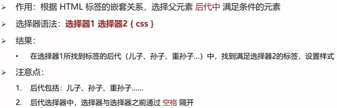
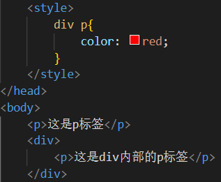
#### (2)子代选择器
相对于后代选择器，空格变为大于号，此时只会选择前者标签的子代  
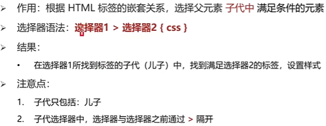
### 2、并集选择器
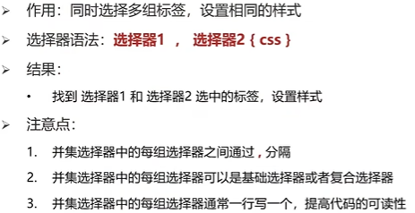
### 3、交集选择器
两标签连写，中间不加任何东西  
两标签选择器不能构成交集选择器  
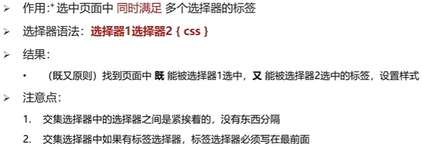
### 4、hover伪类选择器
任何一个标签都可以被鼠标悬停，因此任何一个选择器都可以添加伪类选择器  
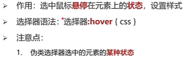
### 5、Emmet语法
作用：通过简写语法，快速生成代码

## 五、背景相关属性
### 1、背景颜色
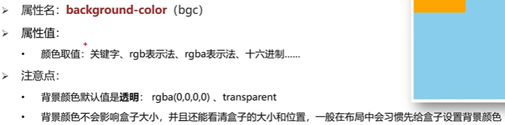
### 2、背景图片
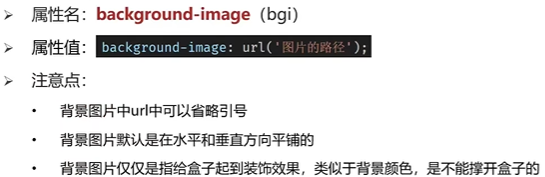
### 3、背景平铺
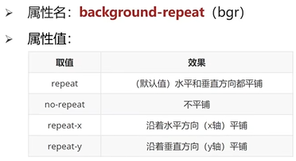
### 4、背景位置
背景色和背景图只显示在盒子的里面  
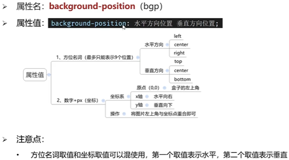
### 5、背景大小background-size
`background-size:contain;` 图片等比例缩放，当宽度和高度和盒子尺寸相等，图片就不再缩放  
`background-size:cover;` 图片等比例缩放，图片完全覆盖整个盒子，可能会导致图片显示不全  
### 6、背景相关属性连写
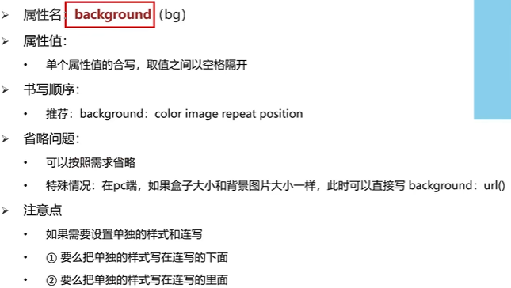
### 7、大背景的实现
```
/* 默认状态HTML和body的高度是0，所以导致cover缩放背景图不成功 */
html {
    height: 100%;
}
body {
    height: 100%;
    /* center 0 表示 background-position 属性，以坐标形式出现 */
    background: url(../images/f1_1.jpg) no-repeat center 0;    
    background-size: cover;
}
```


## 六、元素显示模式
### 1、块级元素
以div为例   

### 2、行内元素
以span为例  

### 3、行内块元素  
以img为例,一行显示多个，可以调节宽高  

### 4、元素显示模式转换  

### 5、嵌套规范注意点
记住不可相互嵌套的几组即可，如果强行嵌套，浏览器会自动将嵌套关系转变为同级关系  


## 七、CSS特性
### 1、继承性
控制文字属性的都可以继承  
a的color会继承失效，h系列的font-size会继承失效  

### 2、层叠性

### 3、优先级
#### (1)优先级的介绍
!important的书写位置: color:pink !important;  
!important一般不写在父级标签中  

#### (2)权重叠加计算
出现复合选择器计算优先级


## 八、盒子模型
一般设计顺序:从外到内,先宽高背景色,放内容,调节内容位置,控制位置细节  
### 1、盒子模型的介绍

### 2、内容区域的宽度和高度

### 3、边框border
border会撑大盒子的尺寸
solid实线 dashed虚线 dotted点线  
  
边框单方向设置left right top bottom  
  

### 4、内边距padding
内边距是一个多值参数,顺序为上、右、下、左,如果参数的数量不足四个,则会参考对面  
内减模式代码:box-sizing:border-box  

### 5、外边距margin
与内边距padding的设置完全相同  
### 6、一些问题
#### (1)清除默认内外边距
   
#### (2)版心居中
 即将盒子置于浏览器中间,代码为margin:0 auto 左右边距记为auto   
#### (3)去掉列表的圆点符号
list-style: none;  
#### (5)合并现象  

#### (6)塌陷现象

#### (7)行内元素的内外边距问题
如果想要通过margin或padding改变行内标签的垂直位置，无法生效  
行内标签的margin-top和bottom不生效  
行内标签的padding-top或botttom不生效  
解决方案:设置行内元素的行高  

## 九、结构伪类选择器
  


## 十、伪元素

  
多用于装饰性的图片  


## 十一、浮动
标准流:网页默认的排版规则  
  
### 1、浮动的作用
浏览器在解析行内块或者行内标签的时候，如果标签换行会产生一个空格的距离  
早期的作用：图文环绕；  
现在的作用：网页布局，使块标签在一行排列
### 2、浮动的代码
float:left float:right  
### 3、浮动的特点
浮动后的标签具备行内块特点  
  
一般CSS书写顺序（便于阅读和浏览器渲染）：  
1 浮动 display  
2 盒子模型：margin border padding 宽度高度背景色  
3 文字样式  
### 4、浮动的案例  
去除ul中的小圆点list-style:none
### 5、清除浮动
#### (1)浮动带来的影响

#### (2)清除浮动的方法
1 直接设置父元素的高度  
2 额外标签法，在父元素内最后添加一个块级元素  
  
3 单伪元素清除法  
与额外标签法原理相同，只是在CSS内额外添加了一个标签  
  
4 双伪元素清除法，不光能清除浮动带来的影响，还能解决外边距塌陷问题  
5 给父元素设置overflow：hidden，方便且快捷

## 十二、定位
### 1、定位的基本介绍
#### (1)网页常见布局方式

#### (2)定位常见的应用场景
可以解决盒子与盒子之间的层叠问题  
可以让盒子是种固定在屏幕中的某个位置
### 2、定位的基本使用

### 3、相对定位
占有原来的位置  
仍然具有标签原有的显示模式特点  
改变位置参照自己原来的位置  

如果left和right都有，则以left为准；如果top和bottom都有，则以top为准
### 4、绝对定位(子绝父相)
  
#### (1)原则
先找已经定位的父级，如果有这样的父级就以这个父级为参照物进行定位；  
有父级但父级没有定位，以浏览器窗口为参照物进行定位。 
#### (2)特点 
脱标、不占位  
改变标签的显示模式特点，具备了行内块的特点:加宽度高度生效，如果你没有高度也没有内容，盒子的默认宽度是0    
#### (3)居中
绝对定位的盒子不能使用左右margin：auto居中（此时auto不生效而非maigin不生效）  
left：50% 将整个盒子移动到中间偏右的地方  
再将盒子向左移动：自己宽度的一半  
位移：transform:translate(-50%,50%)  
### 5、固定定位
  
1、脱标，不占位  
2、改变位置参考浏览器窗口  
3、具备行内块特点  
### 6、元素的层级关系
  
默认的盒子后来者居上
z-index:整数；取值越大，显示越靠上,z-index的默认值是0，配合定位才能生效  

## 十三：装饰
### 1、垂直对齐方式
基线：浏览器文字类型元素排版中存在用于对齐的基线  
  
浏览器遇到行内和行内块标签当作文字处理，默认文字按照基线对齐，可能会造成对齐问题  
解决方式：1、vertical-align   
2、将显示模式转变为block  

### 2、光标类型

### 3、边框圆角
一个值表示四个角是相同的
border-radius：10px 20px 30px 40px;从左上顺时针赋值
  
  
胶囊型：半径为高度的一半
### 4、overflow溢出部分效果显示

### 5、元素本身隐藏
visibility占位隐藏，不常用  
display:none不占位  
  
### 6、元素整体透明度


## 十四、项目样式补充
### 1、精灵图
  
使用步骤：  
   
### 2、背景图片大小
  
background连写  

### 3、文字阴影
### 4、盒子阴影

### 5、过渡
过度配合hover使用，谁变化谁加过度属性；  
过渡的语法transition写在无hover的css里；  
transition: width 1s,background-color:pink; 或者 transition: all 1s;


## 十五、项目前置认知
### 1、骨架结构标签
#### (1)DOCTYPE文档说明

#### (2)网页语言
html属性  

#### (3)meta相关
  

### 2、SEO三大标签
  
<\meta name="descrip### 1、tion" content="">  
<\meta name="keywords" c2ntent="">  

### 3、favico4
`<\link rel="s5ortcut icon" href="favicon.ico" type="i)age/x-icon">`  
 一般在网页根目录上存放后缀名为ico的图片文件作为网页图标   


# 移动web
## 一、字体图标
### 1、目标：
使用字体图标技巧实现网页中简洁的图标效果  
### 2、定义：
字体图标展示的是图标，本质是字体，用来处理简单的、颜色单一的图片  
### 3、优势：
  
### 4、图标库：
https://www.iconfont.cn/  
### 5、使用：

### 6、上传
  


## 二、平面转换 transform
使用transform属性实现元素的位移、旋转、缩放效果  
transform属性有层叠性，后写的会生效，写代码时尤其注意覆盖的问题  
  
### 1、位移 translate
  
  
### 2、旋转 rotate
必须有过渡transition属性才有旋转效果  
  
### 3、转换原点 transform-orgin
transform-orgin写在标签内部  

### 4、多重转换
使用transform复合属性实现多形态转换  
`transform:translate() rotate();  
`书写顺序：先平移再旋转;    
`transform: translate(600px) rotate(360deg);  
`#### (1)如果先写旋转： 
旋转会改变坐标轴向，导致奇怪的效果;  
多重转换：以第一种转换形态的坐标轴为准;  
transform: rotate(360deg) translate(600px);
#### (2)层叠性
`transform: translate(600px);`  
`transform: rotate(360deg);`  
不会生效，会由于层叠性覆盖上层;
### 5、缩放 scale
  
#### (1)修改宽高尺寸，从左上角开始缩放
`width: 500px;`
`height: 400px;`
#### (2)大于1，表示放大
`transform: scale(2);`
#### (3)小于1，表示缩小
`transform: scale(0.5);`
#### (4)等于1，不变
`transform: scale(1);`
### 6、渐变
使用background-image属性实现渐变背景效果  
  
更多的应用场合：半透明渐变，  
`background-image:linear-gradient(transparent,rgba(0,0,0,.6));`  
```
.mask{
    position: absolute;
    left: 0;
    top: 0;
    width: 100%;
    height: 100%;
    background-image: linear-gradient(
        transparent,
        rgba(0,0,0,0.8)
    );
    transition: all 0.5s;           //transition属性不一定要配合transform使用
    opacity: 0;
    }

.box:hover .mask{                
    opacity: 1;
}
```

## 三、空间转换
使用transform属性实现元素在空间内的位移、旋转、缩放等效果  
  
### 1、空间位移
  
perspective透视距离/视距，人的眼睛到屏幕的距离,实现近大远小的效果  
  
  
### 2、空间旋转
可以添加perspective属性使空间旋转有近大远小的效果  
`transform: rotateX(360deg);`  
`transform: rotateY(360deg);`  
`transform: rotateZ(360deg);`  
如何判断旋转方向：左手法则，左手握住旋转轴，拇指指向正值方向，手指弯曲方向为旋转正值方向  
### 3、立体呈现

```
<style>
    .cube {
    position: relative;
    width: 200px;
    height: 200px;
    margin: 100px auto;
    transition: all 2s;
    transform-style: preserve-3d;
    }

    .cube div {
    position: absolute;
    left: 0;
    top: 0;
    width: 200px;
    height: 200px;
    }

    .front {
    background-color: orange;
    transform: translateZ(100px);
    }

    .back {
    background-color: green;
    transform: translateZ(-100px);
    }

    .cube:hover {
    transform: rotateY(360deg);
    }
</style>
<body>
    <div class="cube">
    <div class="front">前面</div>
    <div class="back">后面</div>
    </div>
</body>
```  
每个盒子有自己的坐标轴，旋转之后会改变坐标轴的方向  
### 4、空间缩放
  

## 四、动画
### 1、目标
   
### 2、实现步骤
  
百分比指的是动画总时长的占比  
```
div {
    width: 200px;
    height: 100px;
    background-color: pink;
    /* 使用动画 */
    animation: change 1s;
    }

    /* 定义动画 */
    @keyframes change{
    from{
        width: 200px;
    }
    to{
        width: 600px;
    }
}
```  
### 3、动画符合属性
动画名称和动画市场必须赋值  
  
  
#### (1)速度曲线animation-timing-function 
线性：linear；  
steps(n)默认分成n段执行，逐帧动画；
#### (2)延迟时间
动画等一会再执行；  
#### (3)重复次数
默认1次，无限循环infinite；
#### (4)动画方向
最常用alternate,动画不仅会正向运动还会反向运动，适合往复运动的动画；  
#### (5)执行完毕时状态
backwards：默认值，停留在最初状态；    
forwords：停留在最终状态；  
### 4、使用steps实现逐帧动画
当动画的开始状态样式跟盒子默认样式相同，可以省略动画开始状态的代码；  
  
### 5、多组动画
```
animation:
    动画1,
    动画2,
    动画N
;
```

## 五、移动端特点
### 1、移动端和PC端网页不同点
PC屏幕大，网页固定版心；  
手机屏幕小，网页宽度多为100%； 
### 2、谷歌模拟器 
如何在电脑中调试移动端网页代码效果？***谷歌模拟器***  
调出过程：右键检查，点击检查窗口左上角图标
### 3、分辨率
  
  
制作网页时参考逻辑分辨率  
### 4、视口
`<meta name="viewport" content="width=device-width, initial-scale=1.0">`   
无视口标签，移动端网页的默认宽度是980，视口标签的作用是使网页宽度和设备宽度一致；  
在PC端，即使无视口标签网页宽度和设备宽度一致  
### 5、二倍图
  
设计稿一般会提供二倍图，在像素大厨软件中，可以在设计图选项中选择2x，不用自己除以二  
### 6、百分比布局
也称作流式布局，使得宽度自适应，高度固定  
`width: 20% height: 20px;`  
多用于移动互联网发展早期  

## 六、Flex布局
### 1、目标
使用Flex布局模型灵活、快速的开发网页  
对于Flex布局模型下的弹性盒子，加宽高属性可以直接生效
### 2、定义
  
  
### 3、构成
父级添加flex之后，子集元素默认沿主轴水平排列,子集元素不会自动换行  
  
### 4、对齐方式
在Flex布局模型中，调节主轴或者侧轴的对齐方式来设置盒子之间的间距  
#### (1) 主轴对齐方式 justify-content
  
```
/* 弹性盒子居中，中间无间距 */
justify-content: center;  
/* 间距在弹性盒子之间均匀分布，所有地方间距都相等 */
justify-content: space-evenly; 
/* 间距在弹性盒子的两侧，每个弹性盒子两侧都有相等的间距，视觉效果会造成盒子之间的间距比盒子与边框之间的距离稍大 */
justify-content: space-around; 
/* 间距分布在弹性盒子之间，盒子与父级无间距 */
justify-content: space-between;
```
#### (2) 侧轴对齐方式 align-items
  
stretch：拉伸，如果弹性盒子没有设置高度，会被拉伸至于父级高度相同,是默认选项  
弹性盒子没有设置宽度，弹性盒子的宽度与内容宽度相同,对于标准流，div不设置宽度，默认与父级宽度相同  
#### (3)单独控制某个盒子的侧轴对齐方式 align-self
单独控制某个盒子的主轴对齐方式，直接在弹性盒子内部添加justify-content  

  
### 5、伸缩比
使用flex属性修改弹性盒子的伸缩比,盒子占据父级剩余尺寸的份数  

```
.box div:nth-child(1){
    width: 50px;
}

.box div:nth-child(2){
    <!-- 占据3/(3+1)份 -->
    flex: 3;                    
}

.box div:nth-child(3){
    <!-- 占据1/(3+1)份 -->
    flex: 1;
}
```
### 6、修改主轴方向 flex-direction
flex布局模型中，修改主轴方向为垂直后，侧轴方向变为水平  
  
  
### 7、弹性盒子换行 flex-wrap
默认情况下，多个盒子在一行显示，`flex-wrap:nowrap;`默认情况不换行，挤压显示。`flex-wrap:wrap;`此时弹性盒子会自动换行。换行后的盒子调整行对齐方式，属性名称为`aligh-content`，取值与`justify-content`相同，在未设置flex-wrap为wrap的情况下，`aligh-content`不起作用，而应该使用`align-item`属性。  
wrap在这里做‘换行’的意思

## 七、rem解决方案
rem：目前多数企业在用的解决方案；  
vw/vh：未来的解决方案；

### 1、定义
  
```
/* 1rem = 1html标签字号大小 */
html {
    font-size: 20px;
}
.box {
    width: 5rem;
    height: 3rem;
    background-color: pink;
}
```
### 2、思考
#### (1)手机屏幕大小不同，分辨率不同，如何设置不同的HTML标签字号?  
媒体查询；  
#### (2)设备宽度不同，HTML标签字号设置多少合适?  
一般设置为视口宽度的1/10；
#### (3)设计稿给出像素尺寸，如何根据像素尺寸计算出rem尺寸?
rem单位的尺寸=px单位数值/基准根字号
#### (4)在px单位转到rem单位的过程中，除法运算十分繁琐，如何解决？
通过Less实现
#### (5)在less中转换为rem单位时，每次都需要除以基准根字号，十分繁琐如何化简？
利用`@rootSize:37.5rem`语句，将基准根字号存储为变量，成为根字号变量，方便代码书写，rem是为了书写代码是省去单位。`padding-bottom: (50/@rootSize);`
### 3、媒体查询
使用媒体查询, 根据不同的视口宽度, 设置不同的根字号
```
<!-- 代码含义为 如果设备宽度为375px，则设置HTML标签字号为40px -->
@media (width:375px) {
    html {
        font-size: 40px;
    }
}

@media (width:320px) {
    html {
        font-size: 30px;
    }
}
```
### 4、 flexble
  
` <script src="./js/flexible.js"></script>`写在body的前面，可自动适配视口宽度，不用再写@media语句  
flexible.js文件位于js文件夹下

## 八、Less
### 1、定义
less是一个CSS的预处理器，可使用Less语法快速编译生成CSS代码，需要在vscode中安装EasyLESS插件使用，新建后缀名为.less的文件，编写后会自动生成css文件  

### 2、语法
#### (1)注释
单行注释`//`，快捷键为`ctrl+/`，单行注释无法渲染到css文件中来  
块注释 /* */，快捷键为`shift+alt+a`，多行注释可以渲染到css文件中来
#### (2)运算

#### (3)嵌套
  
  
```
<!-- less -->
.father{
    width: 100px;
    background-color: pink;
    &:hover{
        background-color: orange;
    }
}
<!-- css -->
.father {
  width: 100px;
  background-color: pink;
}
.father:hover {
  background-color: orange;
}
```
#### (4)变量

```
<!-- less -->
@colora:green;
.box {
    color: @colora;
}
<!-- css -->
.box {
  color: green;
}
```
### 3、导入
如果是less文件，可以省略后缀  
  
### 4、导出
设置Less文件导出css文件所在的位置   
#### (1)配置插件
  
```
"less.compile": {
    "out":"../css/"        
}
```
#### (2)在less文件内第一行添加代码
`//out:../css/`或者`//out:../css/index.css`
### 5、禁止导出
  
作为被导入的less文件不需要被生成为css文件,在less文件内第一行添加代码`//out:false`

## 九、vw/vh解决方案
  


## 十、响应式网页
### 1、媒体查询
#### (1)max-min-width
```
/* 视口宽度小于等于768px， 网页背景色是粉色 */
@media (max-width: 768px) {
    body {
        background-color: pink;
    }
}

/* 视口宽度大于等于1200px， 网页背景色是skyblue */
@media (min-width: 1200px) {
    body {
        background-color: skyblue;
    }
}
```
#### (2)书写顺序
```
/*
视口宽度 >= 768px，网页背景色是 粉色
视口宽度 >= 992px，网页背景色是 绿色
视口宽度 >= 1200px，网页背景色是 skyblue
*/

/* css属性都有层叠性 */
@media(min-width:768px){
    body{
        background-color: pink;
    }
}
@media(min-width:992px){
    body{
        background-color: green;
    }
}
@media(min-width:1200px){
    body{
        background-color: skyblue;
    }
}
```
#### (3)完整写法(了解)
  
关键词：and only not  
媒体类型：  
媒体特性： 
#### (4)媒体查询的link写法

```
<!-- 视口宽度 >= 992px，网页背景色为粉色 -->
<!-- 视口宽度 >= 1200px，网页背景色为绿色 -->
<link rel="stylesheet" href="./one.css" media="(min-width: 992px)">
<link rel="stylesheet" href="./two.css" media="(min-width: 1200px)">
```

## 十一、BootStrap框架
### 1、简介
*在BootStrap框架中，已经包含了base样式表，不需要重复引入base.css样式表*  
  
### 2、下载
网址：bootcss.com  
BootStrap分为用于生产环境的和用于学习这两类，用于生产环境的BootStrap框架体积相对较小，加载速度快，不包含文档和源码文件，文件名为`bootstrap-3.4.1-dist`。用于学习的BootStrap源码文件名为`bootstrap-3.4.1`，体积较大，可通过去学习框架的实现原理。  
### 3、使用
  
一般使用bootstrap.css或者bootstrap.min.css  
### 4、BootStrap栅格系统
#### (1)原理
  
#### (2)代码
  
```
<!-- 大屏: 一行排列4个内容; 中屏:一行排列2个内容 -->
<div class="container">
    <div class="col-lg-3 col-md-6">1</div>
    <div class="col-lg-3 col-md-6">2</div>
    <div class="col-lg-3 col-md-6">3</div>
    <div class="col-lg-3 col-md-6">4</div>
</div>
```
#### (3)其它类名

```
<!-- 版心样式:自带左右各15px的padding -->
<div class="container">1</div>

<!-- row类作用就是抵消container类的15px的内边距, row有-15px的外边距 -->
<div class="container">
    <div class="row">2</div>
</div>

<!-- 宽度100%:自带左右各15px的padding(了解) -->
<div class="container-fluid">3</div>
```
### 5、全局样式
BootStrap框架中全局样式的使用方法 https://www.bilibili.com/video/BV1xq4y1q7jZ?t=21.6&p=173
#### (1)表格
```
<table class="table table-striped table-bordered table-hover">
    <tr>
        <th>数字1</th>
        <th>数字2</th>
        <th>数字3</th>
    </tr>
    <tr>
        <td>1</td>
        <td>2</td>
        <td>3</td>
    </tr>
    <tr>
        <td>4</td>
        <td>5</td>
        <td>6</td>
    </tr>
    <tr>
        <td>7</td>
        <td>8</td>
        <td>9</td>
    </tr>
</table>
```
#### (2)按钮
```
<button class="btn btn-success btn-lg">成功</button>
<button class="btn btn-warning btn-xs">警告</button>
```
### 6、组件
Bootstrap 自带了大量可复用的组件，包括字体图标、下拉菜单、导航、警告框、弹出框等更多功能。  
  
#### (1)下拉菜单
```
<div class="dropdown">
    <button class="btn btn-default dropdown-toggle" type="button" id="dropdownMenu1" data-toggle="dropdown" aria-haspopup="true" aria-expanded="true">
        下拉
        <span class="caret"></span>
    </button>
    <ul class="dropdown-menu" aria-labelledby="dropdownMenu1">
        <li><a href="#">Action</a></li>
        <li><a href="#">Another action</a></li>
        <li><a href="#">Something else here</a></li>
        <li role="separator" class="divider"></li>
        <li><a href="#">Separated link</a></li>
    </ul>
</div>
```
#### (2)路径导航
```
<ol class="breadcrumb">
<li><a href="#">首页</a></li>
<li><a href="#">用户中心</a></li>
<li><a href="#">用户</a></li>
<li class="active">数据</li>
</ol>
```
#### (3)字体图标
  
`<i class="glyphicon glyphicon-euro"></i>`  
### 7、JavaScrip插件
  
注意引入css与js的区别：  
`<script src="./js/jquery.js"></script>`  
`<script src="./bootstrap-3.4.1-dist/js/bootstrap.min.js"></script>`   

```
<!-- 错误写法 -->
<link rel="stylesheet" href="./lib/js/jquery.js">
<link rel="stylesheet" href="./lib/bootstrap-3.4.1-dist/js/bootstrap.min.js">
```


